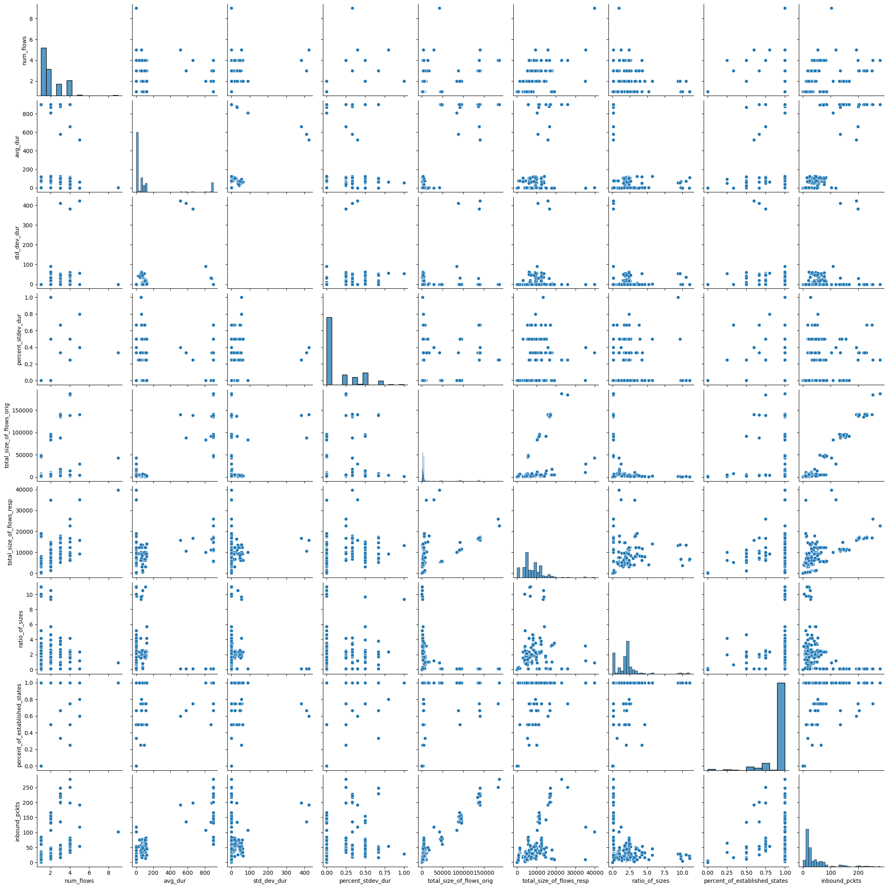

# Malware detectors on CTU-50

This repo contains the code and experiments to detect malware on CTU-50 dataset

# Data

In the folder `ctu-50-features` are the folders with the data. The data are preprocessed features for the TLS connections of the CTU-50 dataset.

The folders are:

        ├── Client1 (benign)
        │   ├── Day1
        │   │   └── comb_features.csv
        │   ├── Day2
        │   │   └── comb_features.csv
        │   ├── Day3
        │   │   └── comb_features.csv
        │   ├── Day4
        │   │   └── comb_features.csv
        │   └── Day5
        │       └── comb_features.csv
        ├── Client10 (benign)
        │   ├── Day1
        │   │   └── comb_features.csv
        │   ├── Day2
        │   │   └── comb_features.csv
        │   ├── Day3
        │   │   └── comb_features.csv
        │   ├── Day4
        │   │   └── comb_features.csv
        │   └── Day5
        │       └── comb_features.csv
        ├── Client2 (benign)
        │   ├── Day1
        │   │   └── comb_features.csv
        │   ├── Day2
        │   │   └── comb_features.csv
        │   ├── Day3
        │   │   └── comb_features.csv
        │   ├── Day4
        │   │   └── comb_features.csv
        │   └── Day5
        │       └── comb_features.csv
        ├── Client3 (benign)
        │   ├── Day1
        │   │   └── comb_features.csv
        │   ├── Day2
        │   │   └── comb_features.csv
        │   ├── Day3
        │   │   └── comb_features.csv
        │   ├── Day4
        │   │   └── comb_features.csv
        │   └── Day5
        │       └── comb_features.csv
        ├── Client4 (benign)
        │   ├── Day1
        │   │   └── comb_features.csv
        │   ├── Day2
        │   │   └── comb_features.csv
        │   ├── Day3
        │   │   └── comb_features.csv
        │   ├── Day4
        │   │   └── comb_features.csv
        │   └── Day5
        │       └── comb_features.csv
        ├── Client5 (benign)
        │   ├── Day1
        │   │   └── comb_features.csv
        │   ├── Day2
        │   │   └── comb_features.csv
        │   ├── Day3
        │   │   └── comb_features.csv
        │   ├── Day4
        │   │   └── comb_features.csv
        │   └── Day5
        │       └── comb_features.csv
        ├── Client6 (benign)
        │   ├── Day1
        │   │   └── comb_features.csv
        │   ├── Day2
        │   │   └── comb_features.csv
        │   ├── Day3
        │   │   └── comb_features.csv
        │   ├── Day4
        │   │   └── comb_features.csv
        │   └── Day5
        │       └── comb_features.csv
        ├── Client7 (benign)
        │   ├── Day1
        │   │   └── comb_features.csv
        │   ├── Day2
        │   │   └── comb_features.csv
        │   ├── Day3
        │   │   └── comb_features.csv
        │   ├── Day4
        │   │   └── comb_features.csv
        │   └── Day5
        │       └── comb_features.csv
        ├── Client8 (benign)
        │   ├── Day1
        │   │   └── comb_features.csv
        │   ├── Day2
        │   │   └── comb_features.csv
        │   ├── Day3
        │   │   └── comb_features.csv
        │   ├── Day4
        │   │   └── comb_features.csv
        │   └── Day5
        │       └── comb_features.csv
        ├── Client9 (benign)
        │   ├── Day1
        │   │   └── comb_features.csv
        │   ├── Day2
        │   │   └── comb_features.csv
        │   ├── Day3
        │   │   └── comb_features.csv
        │   ├── Day4
        │   │   └── comb_features.csv
        │   └── Day5
        │       └── comb_features.csv
        └── Malware
            ├── CTU-Malware-Capture-Botnet-219-2
            │   ├── Day1
            │   │   └── comb_features.csv
            │   ├── Day2
            │   ├── Day3
            │   ├── Day4
            │   └── Day5
            ├── CTU-Malware-Capture-Botnet-230-1
            │   ├── Day1
            │   │   └── comb_features.csv
            │   ├── Day2
            │   ├── Day3
            │   ├── Day4
            │   └── Day5
            ├── CTU-Malware-Capture-Botnet-246-1
            │   ├── Day1
            │   │   └── comb_features.csv
            │   ├── Day2
            │   │   └── comb_features.csv
            │   ├── Day3
            │   │   └── comb_features.csv
            │   ├── Day4
            │   │   └── comb_features.csv
            │   └── Day5
            │       └── comb_features.csv
            ├── CTU-Malware-Capture-Botnet-327-2
            │   ├── Day1
            │   │   └── comb_features.csv
            │   ├── Day2
            │   │   └── comb_features.csv
            │   ├── Day3
            │   │   └── comb_features.csv
            │   ├── Day4
            │   │   └── comb_features.csv
            │   └── Day5
            │       └── comb_features.csv
            ├── CTU-Malware-Capture-Botnet-346-1
            │   ├── Day1
            │   │   └── comb_features.csv
            │   ├── Day2
            │   │   └── comb_features.csv
            │   ├── Day3
            │   │   └── comb_features.csv
            │   ├── Day4
            │   │   └── comb_features.csv
            │   └── Day5
            │       └── comb_features.csv
            └── CTU-Malware-Capture-Botnet-67-1
                ├── Day1
                │   └── comb_features.csv
                ├── Day2
                │   └── comb_features.csv
                ├── Day3
                │   └── comb_features.csv
                ├── Day4
                │   └── comb_features.csv
                └── Day5
                    └── comb_features.csv

If some day does not have a CSV file is because there was not malware during that day.

## CUDA
If it happens that the code gives you the error:

    2023-03-06 11:33:24.900108: W tensorflow/compiler/xla/service/gpu/llvm_gpu_backend/gpu_backend_lib.cc:326] libdevice is required by this HLO module but was not found at ./libdevice.10.bc
    2023-03-06 11:33:24.900325: W tensorflow/core/framework/op_kernel.cc:1830] OP_REQUIRES failed at xla_ops.cc:446 : INTERNAL: libdevice not found at ./libdevice.10.bc
    ...
    libdevice not found at ./libdevice.10.bc

It may be because CUDA can not find that library where you have it installed. Try this in your Python

    export XLA_FLAGS=--xla_gpu_cuda_data_dir=/usr/lib/cuda

Or in the case of Jupyter you can do

    import os
    os.environ['XLA_FLAGS']="--xla_gpu_cuda_data_dir=/usr/lib/cuda"

## Explanation of which malware and users are in the dataset

## Explanation of the data

Each row/sample in the `comb_fatures.csv` files is an aggregation of many TLS flows. The idea is to put together the flow that go to the same service so to model the behavior of the user/malware respect to the same service (for example https://mail.google.com).

The aggregation works as follows:
1. Take all the TLS flows that *share* the same **source IP**, **destination IP**, **destination port**, and **protocol**.
2. Compute some features on these aggregated flows, such as for example the amount of flows.

The complete list of features was originally created by František Střasák [here](https://dspace.cvut.cz/bitstream/handle/10467/68528/F3-BP-2017-Strasak-Frantisek-strasak_thesis_2017.pdf) and adapted by Pavel Janata [here]().

## Labels
There are two columns for labels: 
- `label`: Main label, the vales can be `Malicious`, `Benign` or `Background`.
- `detailedlabel`: It has more details.
    - For the `Benign` label the options are: `Dropbox`, `ESET`, `Microsoft`.
    - For the `Malicious` label the opotions are: `External-Attack-to-Device`, `CC`, or `CC-with-MITM-from-analysts`.  

**Be careful** that the benign files may also have rows with `malicious` labels because the computer was attacked from the Internet too.

##  Data exploration
To see how data looks like it's good to check the pair plots in the images directory. Please see that there are multiple plots.

